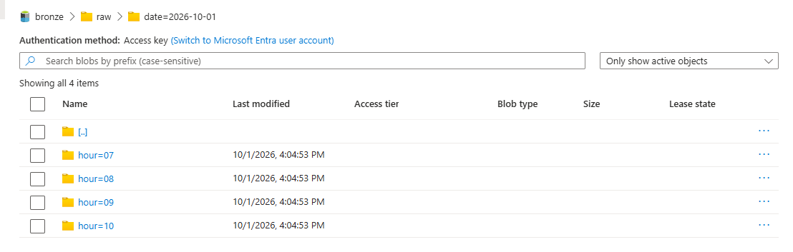
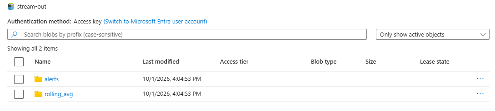
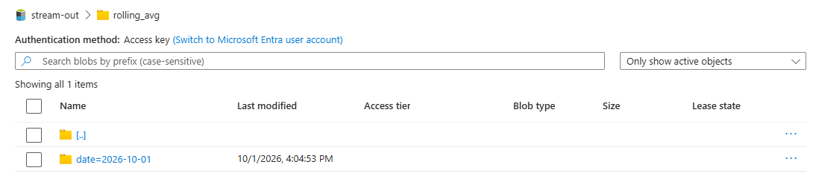
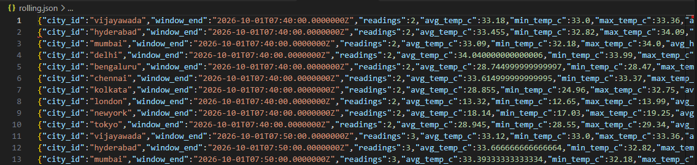
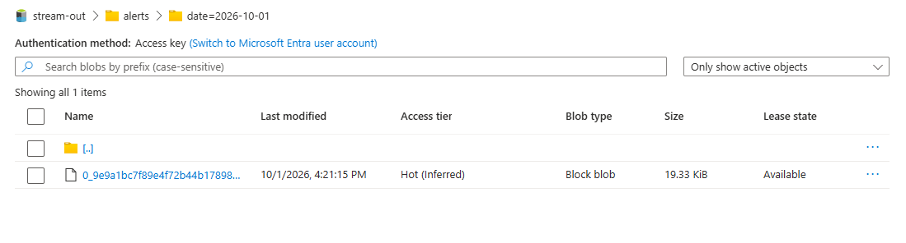
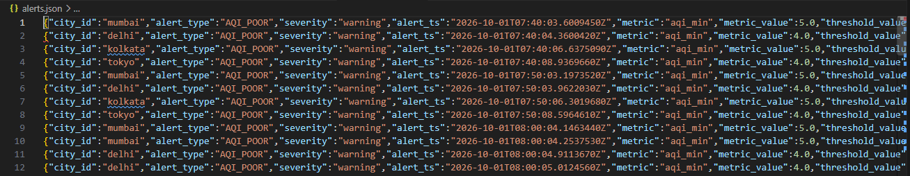

# Layer 2: Stream Processing

> **In simple words:** Layer 1 puts weather readings on a conveyor belt (Event Hub). Layer 2 is a worker (Azure Stream Analytics) that picks up every reading as it arrives and does three jobs: **save it, average it, and watch it for problems.**

**Status:** complete. The job is running and all three outputs have data.

---

## 1. What it does

```
Event Hub "weather-raw"
        │
        ▼
Stream Analytics job  (1 Streaming Unit)
   ├── Job 1: Save every reading ........ bronze / raw        (Parquet files)
   ├── Job 2: Hourly average per city ... stream-out / rolling_avg   (JSON)
   └── Job 3: Spot bad air / big swings . stream-out / alerts        (JSON)
```

| Job | What it produces | Example |
|---|---|---|
| **1. Raw** | Every event, unchanged, stored in the data lake. Layer 3 will clean it | One Parquet file per few minutes |
| **2. Rolling average** | Average, min and max for the last 60 minutes, per city, updated every 10 minutes | "Mumbai avg PM2.5 = 139" |
| **3. Alerts** | A row whenever something looks wrong | "Mumbai air quality is poor" |

---

## 2. The rules behind each job

**Rolling average (hopping window)**
Look at the last **60 minutes** of readings, and recalculate **every 10 minutes**. We recalculate every 10 minutes because new data arrives every 10 minutes, so each update has exactly one new reading.

**Alert 1: `AQI_POOR`**
Air quality index is **4 or higher in 3 or more readings within 30 minutes**. This avoids alerting on a single bad reading.

**Alert 2: `TEMP_SWING`**
Temperature changes by **2°C or more within 20 minutes**.

Alerts use a *sliding window*: it checks the rule every time a new reading arrives, so an alert fires as soon as the condition becomes true.

---

## 3. Key decisions (in plain language)

| Question | Our choice | Why |
|---|---|---|
| Which time do we use for the windows? | `ingest_ts` (when **we** received the reading) | `event_ts` (when the API measured it) can be up to 15 minutes old and differs per city, which would scatter one poll across many windows. `ingest_ts` is almost the same for all 10 cities in a poll |
| What if an event arrives late? | Allow **60 seconds** of lateness and **10 seconds** out of order. After that the event is kept but re-timestamped, not dropped | A poll takes about 12 seconds, so 60 seconds is a safe margin without delaying results |
| How much computing power? | **1 Streaming Unit** | We process about 1 event per minute. Keep usage under 70%. We can scale up later |
| Why Parquet for raw data? | Small, fast, and keeps data types | Databricks reads it directly in Layer 3 |

---

## 4. Files in the repo

| File | What it is for |
|---|---|
| `streaming/weather-job.asaql` | The three queries (the logic) |
| `infra/bicep/stream-analytics.bicep` | Describes the whole job (input, outputs, settings) as code |
| `infra/scripts/03-stream-analytics.ps1` | Creates the containers, deploys the job, gives it permissions |

**What is Bicep?** A text file that describes Azure resources. Instead of clicking in the portal, you run one command and Azure builds exactly what the file says. Anyone can rebuild the job from the repo.

---

## 5. Proof it works

### Job 1: raw events saved in bronze

Files are organised by date and hour. The job was started with a 3-hour replay, so hours 07 to 10 all exist.



### The output container

Rolling averages and alerts each have their own folder.



### Job 2: rolling averages



Each line is one city for one 10-minute mark. `readings` grows from 2 to 3 as the 60-minute window fills up (it reaches 6 after a full hour).



### Job 3: alerts



Mumbai, Delhi, Kolkata and Tokyo raised `AQI_POOR`. This matches the AQI of 4 to 5 seen in the Layer 1 data.



---

## 6. How to run it

```powershell
. .\infra\scripts\env.ps1
.\infra\scripts\03-stream-analytics.ps1
```

Start the job (replays the last 3 hours from Event Hub):

```powershell
$start = (Get-Date).ToUniversalTime().AddHours(-3).ToString("yyyy-MM-ddTHH:mm:ssZ")
az stream-analytics job start --job-name $asa --resource-group $rg --output-start-mode CustomTime --output-start-time $start
```

Check it: `az stream-analytics job show --job-name $asa --resource-group $rg --query jobState -o tsv` should print `Running`.

**Stop it when you are not working.** It costs about $0.11 per hour while running:

```powershell
az stream-analytics job stop --job-name $asa --resource-group $rg
```

---

## 7. Problems we hit

| Problem | Cause | Fix |
|---|---|---|
| `Duplicate output names are not allowed` | Two alert queries wrote to the same output | Combined them with `UNION` into one |
| Downloaded file was empty | I picked a folder instead of the file | Filtered by `.json` |

