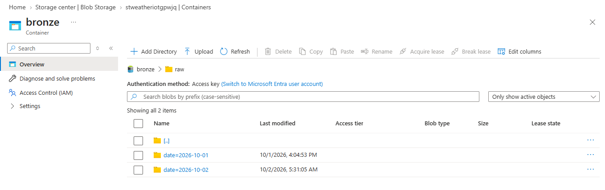
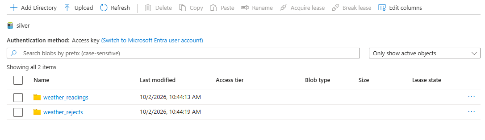
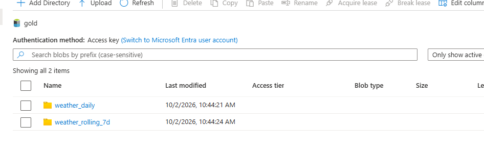
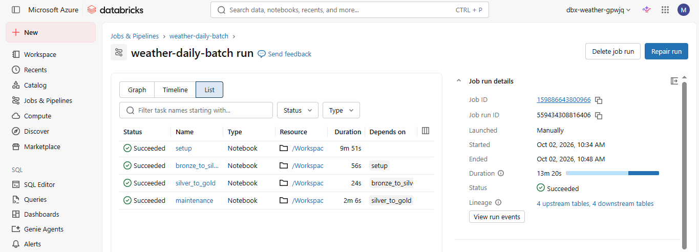
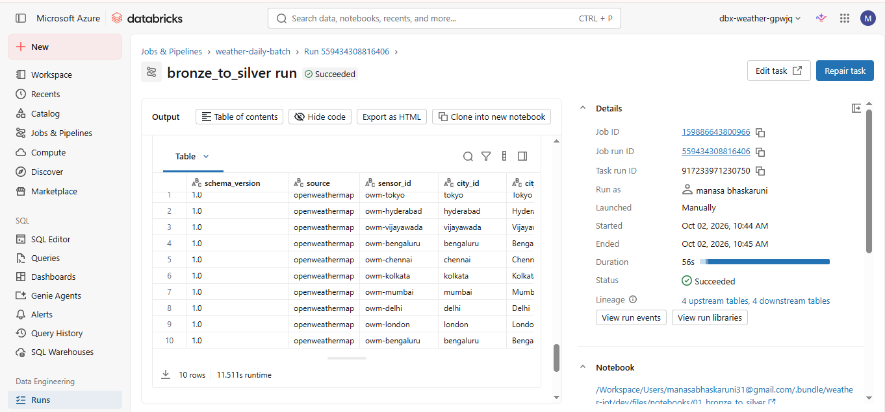
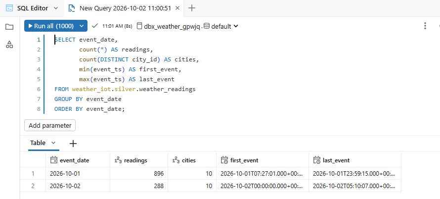
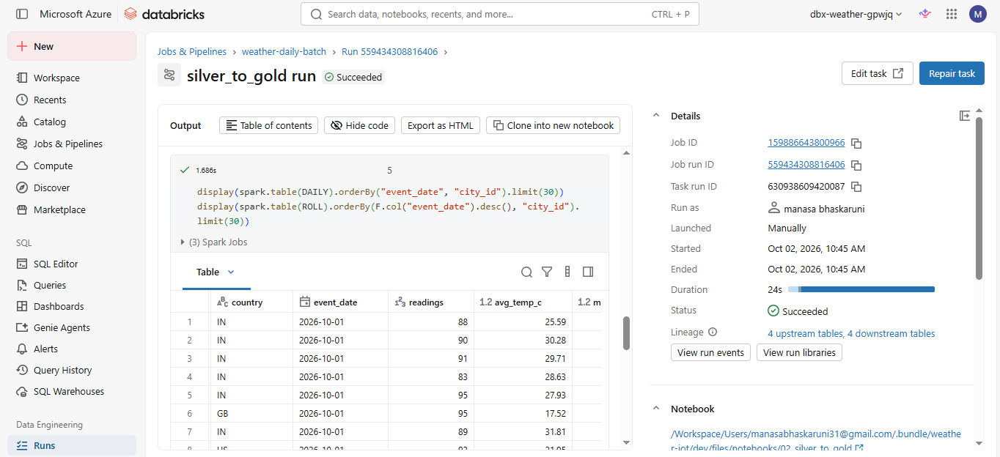

# Layer 3: Batch Transformation

> **In simple words:** Layer 2 saved raw readings into the lake (bronze). Layer 3 runs once a day, **cleans them, removes duplicates, and builds daily summaries**, then registers the results in Unity Catalog so other tools can query them.

**Status:** complete. The Databricks job runs end to end and ADF triggers it daily.

---

## 1. What it does

```
bronze/raw/date=../hour=..     raw Parquet from Stream Analytics
        │   Task 1: clean, validate, remove duplicates
        ▼
silver   weather_iot.silver.weather_readings      (Delta table)
         weather_iot.silver.weather_rejects       (rows that failed checks)
        │   Task 2: aggregate
        ▼
gold     weather_iot.gold.weather_daily           (daily stats per city)
         weather_iot.gold.weather_rolling_7d      (7-day rolling averages)
        │   Task 3: OPTIMIZE + Z-ORDER + VACUUM
        ▼
Registered in Unity Catalog (catalog: weather_iot)
```

| Table | What one row means |
|---|---|
| `silver.weather_readings` | One clean reading per `(city_id, event_ts)`, with no duplicates |
| `silver.weather_rejects` | A reading that failed a check, with the reason |
| `gold.weather_daily` | One city on one day: reading count, avg/min/max temperature, humidity, wind, AQI, PM2.5 and counts per AQI level |
| `gold.weather_rolling_7d` | One city on one day: averages over the last 7 days |

---

## 2. How the daily run is triggered

| File | Role |
|---|---|
| `databricks/databricks.yml` | Defines **what** runs: the job `weather-daily-batch` with four tasks (`setup`, `bronze_to_silver`, `silver_to_gold`, `maintenance`). It has no schedule of its own |
| `infra/bicep/adf.bicep` | Defines **when** it runs: an ADF schedule trigger starts the pipeline, which calls the Databricks job |

```
ADF trigger (every day 01:00 UTC)  ->  ADF pipeline pl_weather_daily
        -> Databricks Job activity  ->  job weather-daily-batch
           setup -> bronze_to_silver -> silver_to_gold -> maintenance
```

- ADF logs in to Databricks with its **managed identity** (no token or password anywhere).
- 01:00 UTC means the previous UTC day is complete, so yesterday's gold row is final. That is 06:30 AM IST.
- **First load:** run once by hand with `lookback_days=30` to load all existing bronze data. **Every day after:** ADF runs with the default `lookback_days=2`.

---

## 3. What each notebook does

| Notebook | Job |
|---|---|
| `00_setup.py` | Creates the catalog `weather_iot`, schemas `silver` and `gold`, and the four tables. Safe to run every time |
| `01_bronze_to_silver.py` | Reads recent bronze files, casts types, validates, removes duplicates, then `MERGE`s into silver |
| `02_silver_to_gold.py` | Builds the daily stats (`MERGE`) and the 7-day rolling table |
| `03_maintenance.py` | `OPTIMIZE ... ZORDER BY`, then `VACUUM` |

### Rules inside the notebooks

**Validation** (a failing row goes to `weather_rejects` with a reason, so nothing disappears silently):

| Check | Allowed |
|---|---|
| `city_id`, `event_ts` | Not empty |
| `temp_c` | -90 to 60 |
| `humidity_pct` | 0 to 100 |
| `pressure_hpa` | 850 to 1090 |
| `aqi` | 1 to 5 |
| `pm2_5` | Not negative |

**Duplicates:** OpenWeatherMap can return the same measurement on two polls, and the Layer 2 replay overlaps too. Rows are grouped by `(city_id, event_ts)` and only the earliest-ingested one is kept.

**Safe to re-run:** every write is a `MERGE`, so running a day twice never creates duplicates.

**The 2-day lookback:** each daily run re-reads the last 2 days of bronze, because yesterday finishes late and today is only partial. The 7-day rolling table is built from the whole `gold.weather_daily` table, not from the lookback, so older days still count. Each day is weighted by its number of readings. The column `days_in_window` shows how many days are in the average, and it grows toward 7 as data builds up.


## 5. Setup (infrastructure as code)

| Piece | Where |
|---|---|
| Databricks workspace (Premium) and access connector | `infra/bicep/databricks.bicep`, run by `04-databricks.ps1` |
| Storage credential `sc-weather` and external locations `el_bronze`, `el_silver`, `el_gold`, `el_uc_managed` | `05-databricks-uc.ps1` |
| Notebooks and the job, deployed from Git as a Databricks Asset Bundle | `databricks/` and `06-databricks-deploy.ps1` |
| Data Factory, linked service, pipeline, daily trigger | `infra/bicep/adf.bicep`, run by `07-adf.ps1` |

How access works, with no passwords anywhere:

| Who | Access |
|---|---|
| Access connector (managed identity) | `Storage Blob Data Contributor` on the data lake, used by Unity Catalog |
| ADF (managed identity) | `Contributor` on the Databricks workspace, so it can start the job |
| The job | Runs as the deploying user, who owns the catalog and external locations |

---

## 6. Evidence

> Paste your screenshots here (save them in `docs/images/`, or paste straight into this file in VS Code).

### Data lake containers

The raw, silver and gold files in Azure Storage.







Each Delta table folder contains a `_delta_log` folder (the version history) next to the Parquet data files.


### Databricks job run

All four tasks green, in order.



Silver has fewer rows than bronze because deduplication removed the repeated API readings.





---

## 7. How to run it

First load, by hand:

```powershell
. .\infra\scripts\env.ps1
.\infra\scripts\06-databricks-deploy.ps1
cd databricks
databricks bundle run weather_daily -t dev --params lookback_days=30
```

Every day after that, ADF runs it at 01:00 UTC. To test ADF without waiting:

```powershell
$runid = az datafactory pipeline create-run --factory-name $adf --resource-group $rg --name pl_weather_daily --query runId -o tsv
az datafactory pipeline-run show --factory-name $adf --resource-group $rg --run-id $runid --query status -o tsv
```


