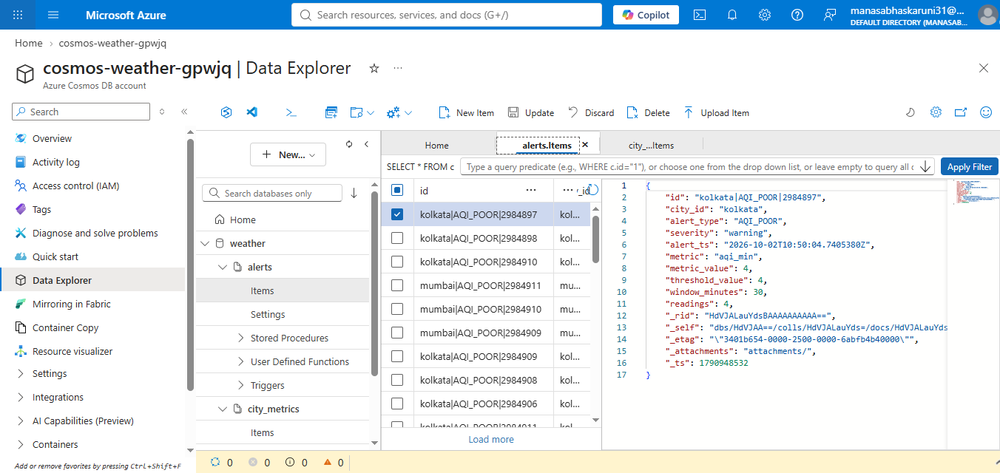
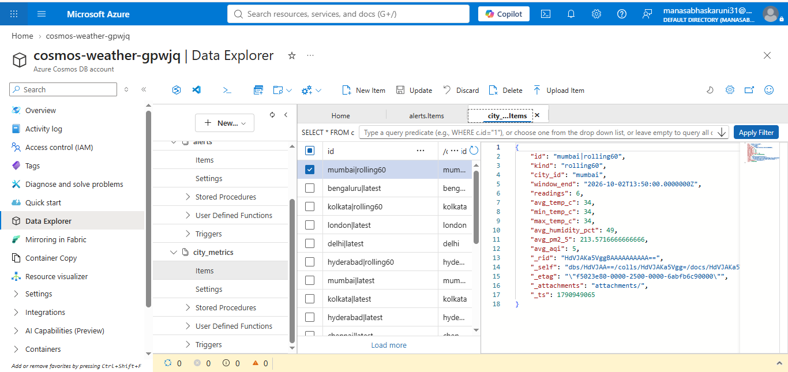
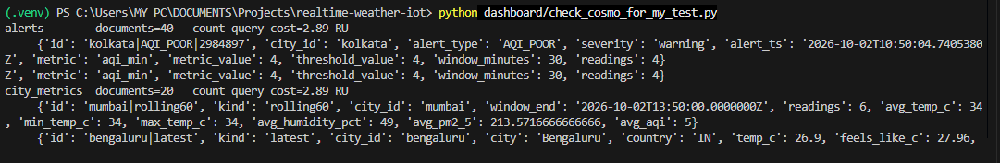
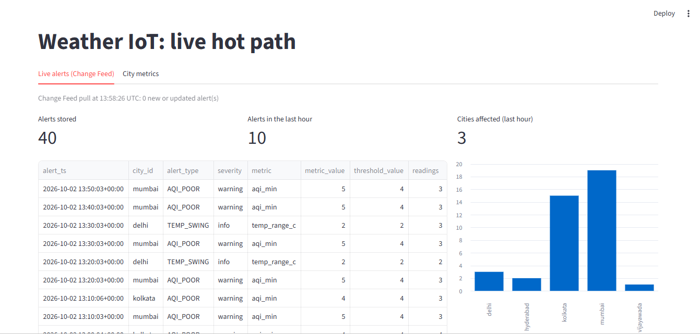
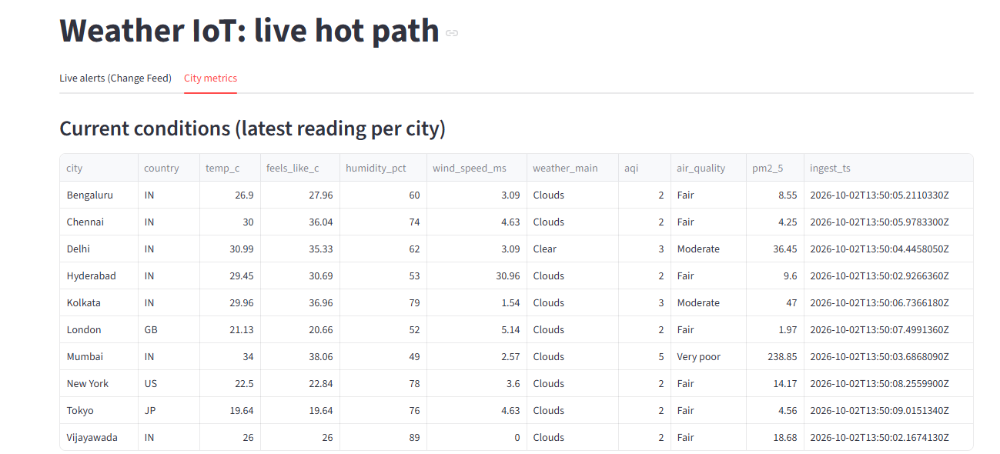
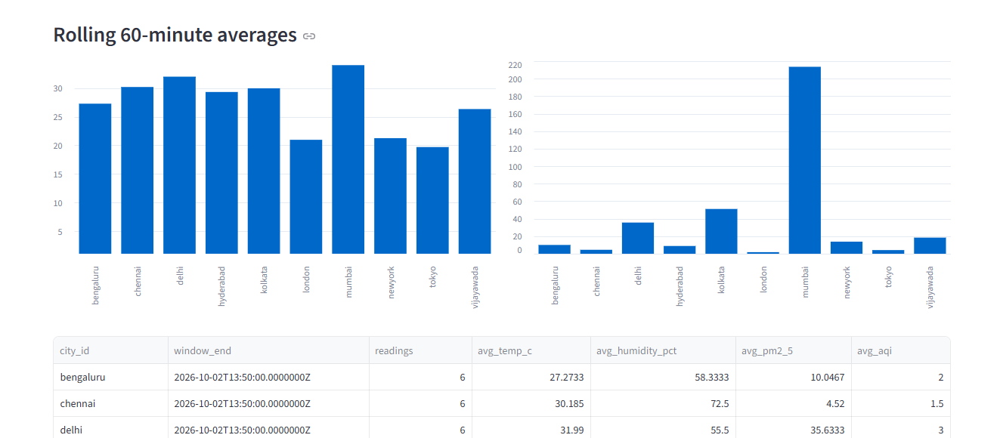

# Layer 4: Hot Path Serving

> **In simple words:** Layer 2 already sends results to the data lake, which is good for history but slow for live views. Layer 4 sends the **same alerts and city values to Cosmos DB** as well, so a new alert shows up within seconds. A **live dashboard** (Streamlit) reads them straight from Cosmos DB.

**Status:** complete. Stream Analytics writes to Cosmos DB, and the dashboard shows live alerts and city metrics.

---

## 1. What it does

We did not build a new job. We **extended the Stream Analytics job from Layer 2**, so one job now has a cold path and a hot path.

```
                      ┌─► ADLS Gen2   (Layer 2, cold path, unchanged)
Event Hub ─► ASA job ─┤
                      └─► Cosmos DB   (Layer 4, hot path, NEW)
                            ├─ container: alerts          (anomaly alerts)
                            └─ container: city_metrics    (latest + 60-min average per city)
                                      │
                                      ▼
                    Streamlit dashboard (refreshes every 10 seconds)
                      ├─ Tab 1: live alerts, read from the Change Feed
                      └─ Tab 2: current conditions + rolling averages
```

| | Cold path (Layer 2) | Hot path (Layer 4) |
|---|---|---|
| Destination | ADLS files | Cosmos DB |
| Used for | History, daily batch in Layer 3 | Live alerts and current city values |
| Speed | Files appear every few minutes | A document appears within seconds |

| Cosmos container | What one document means |
|---|---|
| `alerts` | One anomaly alert (`AQI_POOR` or `TEMP_SWING`) for one city in one 10-minute bucket |
| `city_metrics` (kind `latest`) | The newest reading of one city. Exactly one per city |
| `city_metrics` (kind `rolling60`) | The 60-minute average of one city. Exactly one per city |

---

## 2. How it is wired

| File | Role |
|---|---|
| `infra/bicep/cosmos.bicep` | Creates the Cosmos account, database `weather`, and the two containers |
| `infra/scripts/08-cosmos.ps1` | Runs the Bicep and gives the data-plane roles (no keys) |
| `streaming/weather-job.asaql` | The query. Now also writes to Cosmos and adds `id` and `kind` columns |
| `infra/bicep/stream-analytics.bicep` | Adds three Cosmos outputs to the job |
| `dashboard/app.py` | The Streamlit dashboard |
| `dashboard/check_cosmo_for_my_test.py` | Counts documents and prints the RU cost, used as evidence |
| `dashboard/requirements.txt` | Python packages for the dashboard |

**Three new Stream Analytics outputs**

| Output | Goes to | Content |
|---|---|---|
| `out_alerts_cosmos` | container `alerts` | Anomaly alerts |
| `out_latest_cosmos` | container `city_metrics` | Latest reading per city |
| `out_rolling_cosmos` | container `city_metrics` | 60-minute average per city |

The same alert and average results also still go to ADLS. The only visible change in the ADLS JSON files is two extra columns, `id` and `kind`.


## 3. What the dashboard does

| Tab | Source | Shows |
|---|---|---|
| Live alerts (Change Feed) | `alerts` container | Alerts stored, alerts in the last hour, cities affected, a table of the newest alerts and a bar chart of alerts per city |
| City metrics | `city_metrics` container | Current conditions per city (temperature, humidity, wind, weather, AQI, PM2.5) and 60-minute averages as charts and a table |

- Both tabs refresh every **10 seconds**.
- Tab 1 uses the **Cosmos DB Change Feed**: it keeps a continuation token and pulls only what changed since the last pull. Alerts are kept by `id`, so an updated alert overwrites the old one on screen.
- Tab 2 reads `city_metrics`, which is tiny (20 documents), so a plain query is enough.
- The dashboard runs on the laptop and costs nothing.

---


### Push dataset limitations in Power BI

| Limitation | Meaning |
|---|---|
| New ones cannot be created | Microsoft announced that creation of new real-time (push and streaming) semantic models stops from 31 October 2024, and existing ones retire in October 2027. Real-Time Intelligence in Microsoft Fabric is the replacement. *Check Microsoft's current Power BI docs before submitting.* |
| Not in Power BI Desktop | They can only be created in the Power BI Service, which needs a work or school account |
| Not a history store | Rows are held in a limited rolling store, oldest dropped first |
| Limited features | Pure streaming datasets cannot use DAX measures and support only basic visuals |
| Rate and size caps | You push aggregates, not every event |

---

## 5. Why Streamlit instead of Power BI

The case study asks for Power BI to read the Change Feed, and a push streaming dataset for real-time city metrics. We built the **same hot path** (Stream Analytics to Cosmos DB) and replaced only the **viewer** with a Streamlit dashboard.

| Reason | Detail |
|---|---|
| **Student account** | Power BI Service needs a work or school account. With the Azure student free account, sign-in to the Service was blocked |
| **Power BI Desktop is possible, but not live** | Desktop can connect to Cosmos DB and build a report, but it only shows data as of the last refresh. A live view would need a refresh pipeline (scheduled refresh or a gateway), and that again needs the Power BI Service. So it would be a snapshot report, not a live dashboard |
| **Push datasets** | New ones cannot be created (see section 4), and they cannot be built in Desktop anyway |
| **No Change Feed connector** | Power BI cannot read the Cosmos Change Feed directly, so something in between is needed in any case |

| Case study asks | What we built |
|---|---|
| ASA writes anomaly alerts to Cosmos DB | Same |
| Power BI reads the Change Feed for a live alert dashboard | The dashboard reads the Change Feed itself and shows alerts live |
| Push dataset with real-time city metrics | ASA writes the latest reading and 60-minute average per city to a second container, and the dashboard shows them live |

This is a documented deviation. The architecture, the Cosmos design and the Change Feed pattern are as specified. If a Power BI Service account becomes available, a Desktop report on the same Cosmos data can be added without changing anything else.

---

## 6. Setup (infrastructure as code)

| Piece | Where |
|---|---|
| Cosmos DB account, database, containers | `infra/bicep/cosmos.bicep`, run by `08-cosmos.ps1` |
| Data-plane roles for ASA and for me | `08-cosmos.ps1` |
| Cosmos outputs on the job | `infra/bicep/stream-analytics.bicep` |
| Updated query | `streaming/weather-job.asaql` |
---

## 7. Evidence

> Paste your screenshots here (save them in `docs/images/`, or paste straight into this file in VS Code).

### Cosmos DB Data Explorer

The `alerts` container. Ids look like `kolkata|AQI_POOR|2984897`, with the city, alert type, severity, metric value, threshold and window size.



The `city_metrics` container. It holds one `latest` and one `rolling60` document per city. For example `mumbai|rolling60` has 6 readings, an average temperature of 34 C and an average PM2.5 of about 213.



### Verification script

```powershell
. .\infra\scripts\env.ps1
python dashboard/check_cosmo_for_my_test.py
```

| Container | Documents | Meaning |
|---|---|---|
| `alerts` | 40 | Alerts from the 3-hour replay and live data |
| `city_metrics` | 20 | 10 `latest` + 10 `rolling60`, one of each per city, as designed |



### Live dashboard: Live alerts tab

It showed **40 alerts stored, 10 in the last hour, and 3 cities affected** in the last hour. Alerts per city: Mumbai 19, Kolkata 15, Delhi 3, Hyderabad 2, Vijayawada 1. Mumbai and Kolkata dominate because of poor air quality readings.



### Live dashboard: City metrics tab

Latest reading for each of the 10 cities. For example Mumbai had AQI 5 (Very poor) with PM2.5 of 238.85, which explains its many alerts.



Rolling 60-minute averages of temperature and PM2.5 per city. Mumbai stands out with an average PM2.5 above 200.



---

## 8. How to run it

Deploy Cosmos (this is the command that worked on the student account):

```powershell
. .\infra\scripts\env.ps1
.\infra\scripts\08-cosmos.ps1 -Mode serverless -CosmosLocation koreacentral
```

Redeploy and start the job (the job must be stopped first, because outputs cannot change while it runs). The 3-hour replay makes alerts appear within minutes:

```powershell
az stream-analytics job stop --job-name $asa --resource-group $rg
az deployment group create --resource-group $rg --template-file infra/bicep/stream-analytics.bicep --parameters jobName=$asa eventHubNamespace=$ehns eventHubName=$eh storageAccountName=$sa cosmosAccountName=$cosmos location=$loc --output none
$start = (Get-Date).ToUniversalTime().AddHours(-3).ToString("yyyy-MM-ddTHH:mm:ssZ")
az stream-analytics job start --job-name $asa --resource-group $rg --output-start-mode CustomTime --output-start-time $start
az stream-analytics job show --job-name $asa --resource-group $rg --query jobState -o tsv
```

Expected: `Running`. Wait 5 to 10 minutes, then check Cosmos and start the dashboard:

```powershell
pip install -r dashboard/requirements.txt
python dashboard/check_cosmo_for_my_test.py
streamlit run dashboard/app.py
```

The dashboard opens at `http://localhost:8501`. Stop it with `Ctrl+C`. When done for the day, stop the job:

```powershell
az stream-analytics job stop --job-name $asa --resource-group $rg
```

---


