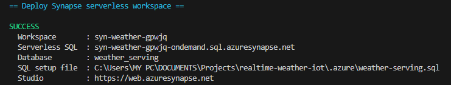

# Layer 5: Cold Path Serving

> **In simple words:** Layer 3 builds the historical gold Delta tables. Layer 5 gives analysts a SQL surface over those files so Power BI can query daily and rolling trends without copying them into another warehouse.

## 1. Data flow

```text
Event Hub -> Stream Analytics -> bronze Parquet
                                  |
                                  v
                         Databricks daily job
                         silver Delta -> gold Delta
                                  |
                                  v
              Synapse serverless SQL (views over Delta)
                                  |
                                  v
                   Power BI DirectQuery reports
```

The existing ADF trigger runs the Databricks job daily at 01:00 UTC. Layer 5 does not add another transformation or copy: it exposes `weather_iot.gold.weather_daily` and `weather_iot.gold.weather_rolling_7d` from the `gold` filesystem at `gold/weather_daily` and `gold/weather_rolling_7d`.

## 2. Why serverless SQL and `OPENROWSET`

The project has ten simulated sensors, compact daily aggregates, and a low-frequency historical reporting workload. A serverless SQL pool has no provisioned warehouse to keep running and charges for data scanned by queries. It is a good fit for this small cold path.

The gold data is Delta Lake, not plain Parquet. Synapse serverless reads these Delta roots with `OPENROWSET(FORMAT = 'DELTA')`. The SQL script wraps each query in a stable view for Power BI. Do not create ordinary external tables over these Delta folders; Synapse's external-table guidance directs Delta workloads to `OPENROWSET`-based views. `OPENROWSET` is not available in dedicated SQL pools.

PolyBase/Hadoop external tables are not the path here. PolyBase is useful when loading external files into a dedicated relational warehouse, where data can then be served from provisioned tables. That adds a second copy, loading/maintenance work, and provisioned compute charges while the pool is active (although dedicated pools can be paused), none of which this weather project needs. A dedicated pool becomes relevant when the workload needs consistently low query latency, high concurrency, relational joins at scale, or predictable provisioned throughput; benchmark before migrating.

Serverless is pay-per-scan, not free. DirectQuery can issue multiple SQL queries per visual and user interaction. Keep report filters foldable, use the daily aggregate views rather than raw bronze/silver, avoid `SELECT *`, and monitor data processed. For a tiny report where refresh latency is acceptable, Power BI Import or an imported aggregation can be faster and cheaper than repeated DirectQuery scans.

---

## 3. Files in the repo

| File | What it is for |
|---|---|
| `infra/bicep/synapse.bicep` | Workspace, firewall rule, Entra admin and storage roles as code |
| `infra/scripts/09-synapse.ps1` | Registers providers, previews and deploys the Bicep, builds the SQL file |
| `synapse/serving.sql` | Database, credential, data source, external tables and views |
| `synapse/validate.sql` | Row counts, NULL checks and sample queries |
| `powerbi/measures.dax` | The DAX measures |

---


## 4. Deploy and define the SQL views

```powershell
. .\infra\scripts\env.ps1
.\infra\scripts\09-synapse.ps1
```

The script creates the `synapse` filesystem, runs ARM `what-if`, deploys the workspace and role assignments, then writes an account-specific SQL file to the ignored `.azure\weather-serving.sql`. In Synapse Studio, open the workspace, select the **Built-in** serverless SQL pool, open that generated file, and run it. It creates database `weather_serving`, the managed-identity data source, and the two views. Run the SQL again after the Databricks gold schema changes.

The view contract matches the gold table schemas from `databricks/notebooks/00_setup.py`. The daily view includes `is_complete_day`; filter to `1` for finalized UTC dates when partial current-day results are not wanted.


## Setup Evidence


## 5. Connect Power BI

In Power BI Desktop, use **Get data > Azure SQL Database** with:

| Setting | Value |
|---|---|
| Server | `<workspace-name>-ondemand.sql.azuresynapse.net` |
| Database | `weather_serving` |
| Connectivity mode | DirectQuery |
| Authentication | Microsoft Entra ID (organizational account) |
| Tables/views | `gold.weather_daily`, `gold.weather_rolling_7d` |

The endpoint is the serverless endpoint, not `<workspace-name>.sql.azuresynapse.net` (that is the dedicated SQL endpoint). Power BI viewers need SQL `SELECT` on schema `gold`, permission to use the database-scoped storage credential, and access to the underlying storage through the Synapse workspace identity. The workspace creator is already the SQL Entra administrator; add explicit least-privilege SQL grants for other report authors/viewers in Synapse Studio.

For an Entra security group of report readers, run this in `weather_serving` as the SQL Entra administrator, replacing the group name:
todo: to deploy this things to power bi


