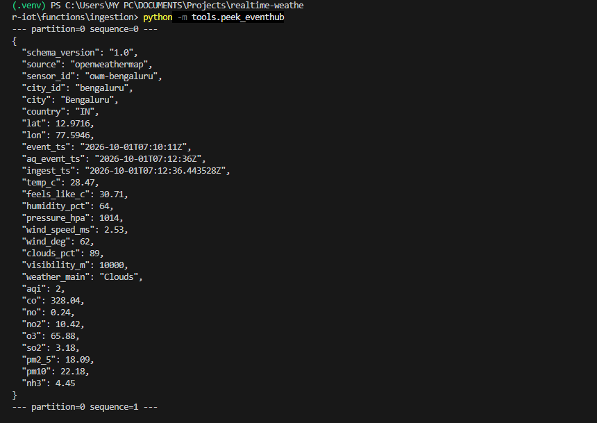
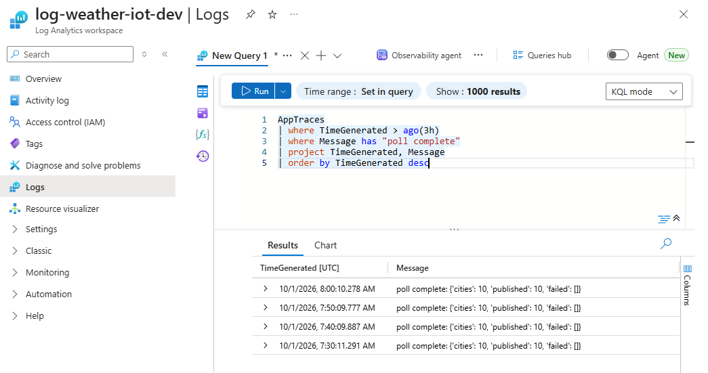

# Layer 1: Ingestion

**Goal:** every 10 minutes, fetch weather and air quality for 10 cities (virtual IoT sensors) from OpenWeatherMap and publish one JSON event per city to Azure Event Hub.

```
Timer (10 min) -> Azure Function -> Key Vault (API key)
                       |-> OpenWeatherMap (weather + air pollution)
                       '-> Event Hub "weather-raw" (4 partitions, key = city_id)
```

## Resources (region: eastasia)

| Resource | Name |
|---|---|
| Resource group | `rg-weather-iot-dev` |
| Key Vault (secret `owm-api-key`) | `kv-weather-gpwjq` |
| Event Hub namespace / hub | `evhns-weather-gpwjq` / `weather-raw` (Standard, 4 partitions) |
| Function App (Python 3.11, timer trigger) | `func-weather-ingest-gpwjq` |
| Log Analytics + Application Insights | `log-weather-iot-dev`, `appi-weather-iot` |

## How it works

1. `function_app.py` holds the timer trigger (`0 */10 * * * *`) and calls `weather_iot/pipeline.py`.
2. `owm.py` reads the API key from Key Vault and calls the Weather and Air Pollution APIs.
3. `pipeline.py` merges both responses into one event per city and adds metadata (`sensor_id`, `event_ts`, `ingest_ts`, `schema_version`).
4. `publisher.py` sends each event to Event Hub with `city_id` as the partition key.

Cities are listed in `config/cities.json`. Setup scripts are in `infra/scripts/` (`00-foundation`, `01-keyvault-eventhub`, `02-function-app`).

## Design answers

- **Event Hub, not IoT Hub:** there are no physical devices, so device identity, twins and cloud-to-device messaging would go unused. IoT Hub costs more and is built on Event Hub.
- **4 partitions:** load is tiny, so partitions are for parallelism and ordering. Using `city_id` as the key keeps each city's events in order, and 4 partitions lets Stream Analytics run in parallel in Layer 2. The count cannot be changed later on Standard tier.
- **10-minute interval:** the free API refreshes about every 10 minutes. 10 cities x 2 calls = 20 calls per run, about 2,880 per day, well under the 60 calls/min limit.
- **Security:** no secrets in code. The Function's managed identity has `Key Vault Secrets User` and `Azure Event Hubs Data Sender`. Event Hub key authentication is disabled.

## Event schema (v1.0)

`event_ts` is when the API measured the data . `ingest_ts`(used for windows in Layer 2) is when our Function fetched it. Weather fields: temp, feels like, humidity, pressure, wind, clouds, visibility. Air quality fields: `aqi`, `co`, `no`, `no2`, `o3`, `so2`, `pm2_5`, `pm10`, `nh3`.
Field	     Same across the 10 cities in one run?
ingest_ts	Nearly (within about 15 s), because we stamp it per city as we fetch
event_ts	No, because the API's measurement time differs per city, by up to about 15 minutes

## Evidence

**Screenshot 1: a real event in Event Hub** (Bengaluru, partition 0). It shows the enriched schema.



**Screenshot 2: the timer running in Azure.** Log Analytics shows `poll complete` at 7:30, 7:40, 7:50 and 8:00 UTC, each with `published: 10` and `failed: []`. This also proves the managed identity works, since nobody is signed in on the Azure side.

```kql
AppTraces
| where TimeGenerated > ago(3h)
| where Message has "poll complete"
| project TimeGenerated, Message
| order by TimeGenerated desc
```



## Run it

```powershell
.\infra\scripts\00-foundation.ps1            # note region and suffix, put them in env.ps1
.\infra\scripts\01-keyvault-eventhub.ps1
# store the API key in Key Vault (secret name: owm-api-key)
.\infra\scripts\02-function-app.ps1
cd functions\ingestion
func azure functionapp publish $fn --python
```

Pause the timer: set app setting `AzureWebJobs.poll_weather.Disabled=true`. Layer 2 reads this hub using consumer group `asa-cg`.(az functionapp config appsettings set --name $fn --resource-group $rg --settings "AzureWebJobs.poll_weather.Disabled=true" --output none)